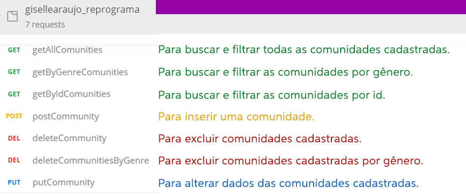

# **PROJETO FINAL** - Turma 7on Back-end {reprograma}

A partir da vivência em uma Maratona Digital promovida pela Unicef, visando contribuir para o acesso ao ensino emoto de estudantes em situação de vulnerabilidade social, **meu projeto será um banco de dados para doação de smartphones, tablets e notebooks usados (em perfeito estado de uso) para estudantes de escolas públicas de comunidades indígenas e quilombolas.**

A API irá armazenar os dados cadastrados das comunidades indígenas e quilombolas indicando a localidade, a quantidade de estudantes e equipamentos que necessitam, além do status de doações recebidas.

## **O PROJETO TERÁ O SEGUINTE SCHEMA:**

**COMUNIDADE** - Para cadastro das comunidades que necessitam das doações.

##### Imagem Editada | Autoria própria

## **TECNOLOGIAS UTILIZADAS**

Git   |   Node.js   |   MongoDB

## **PACOTES**

## **ROTAS** | MÉTODOS E AÇÕES

Com utilização dos métodos HTTP, os dados serão manipulados conforme a necessidade dos cadastros e usuários.

##### Imagem Editada | Autoria própria

## OBS: README em desenvolvimento.
