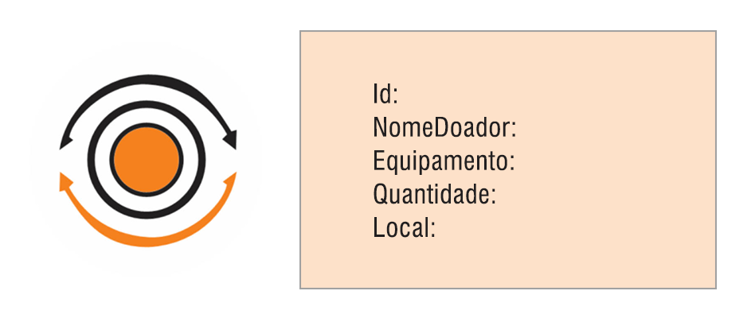

# PROJETO FINAL - Turma 7on Back-end {reprograma}

A partir da vivência em uma Maratona Digital promovida pela Unicef, visando contribuir para o acesso ao ensino emoto de estudantes em situação de vulnerabilidade social,**meu projeto será um banco de dados para doação de smartphones, tablets e notebooks usados (em perfeito estado de uso) para estudantes de escolas públicas de comunidades indígenas e quilombolas.**

## **O PROJETO TERÁ OS SEGUINTES SCHEMAS:**

**1.DOADORES** - Para cadastro de pessoas que pretendem doar seus equipamentos usados, informando sua localidade, o que vai doar, quantidade e onde pretende doar.

##### Imagem Editada | Autoria própria

**2.COMUNIDADE** - Para cadastro das comunidades (indígenas e quilombolas), a partir de seus representantes (líderes comunitários) onde será especificado: a localidade, quantos aparelhos são necessários, quantos já foram recebidos, se desistiu da doação etc.

##### Imagem Editada | Autoria própria

## **TECNOLOGIAS UTILIZADAS**

Git  |  Node.js  |  MongoDB

## **PACOTES**

## **ROTAS**