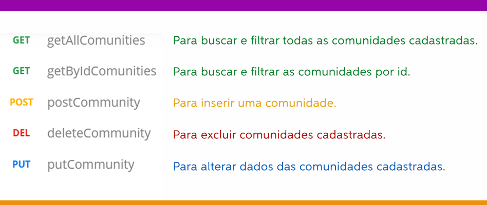

# **PROJETO FINAL Turma 7on Back-end {reprograma} - Porto Digital MINAs** 

## **CONEXÃO COMUNIDADES**

A partir da vivência em uma Maratona Digital promovida pela Unicef, visando contribuir para o acesso ao ensino remoto e aulas a distância de estudantes em situação de vulnerabilidade social, **meu projeto será um banco de dados para doação de smartphones, tablets e notebooks usados (em perfeito estado de uso) para estudantes de escolas públicas de comunidades indígenas e quilombolas.**

Neste projeto apresento a primeira etapa da proposta, onde foi desenvolvida uma API que irá armazenar os dados cadastrados das comunidades indígenas e quilombolas que forem selecionadas para a iniciativa. 

## **O PROJETO TERÁ O SEGUINTE SCHEMA:**

Nesta etapa será possível: 

- Cadastrar uma comunidade
- Buscar / listar as comunidades 
- Filtrar uma comunidade por id
- Alterar / atualizar uma comunidade
- Remover uma comunidade

## **TECNOLOGIAS UTILIZADAS PARA SEU DESENVOLVIMENTO**

- Git/Github
- Node.js 
- MongoDB
- Heroku
- Postman

## **DEPENDÊNCIAS**

- dotenv-safe 
- express 
- mongoose 
- nodemon 

## **ROTAS** | MÉTODOS E AÇÕES

Com utilização das tecnologias citadas, por meio de métodos HTTP, os dados serão manipulados conforme a necessidade dos cadastros e usuários.

## **PRÓXIMAS ETAPAS**

Como citado esta é a primeira etapa de uma projeto, em desenvolvimento. As próximas etapas serão compostas por:

- Filtros por outros parâmetros
- Schema para doadores
- Autenticação para todas as rotas com criação de login

## **GRATIDÃO**

- À Reprograma e à iniciativa do Porto Digital MINAs pela oportunidade de aprendizado e crescimento, pessoal e profissional.

- Às professoras, que foram muito parceiras e deram show de competência, mesmo diante das dificuldades de um curso online com aulas tão longas.

- À Rai, a facilitadora mais maravilinda em linha reta (quem é de Recife entende) Ju, nossa orientadora educacional mais que querida S2 e todas as monitoras que foram super atenciosas.

- Às meninas da turma, muito obrigada. Vocês são arretadas!!!

- À Nadyédja e Tereza, amigas da turma, que foram super parceiras nessa caminhada.

- À inteligência suprema do universo que denominamos Deus.

   **Agora, é apontar pra fé e remar! ;)** 

